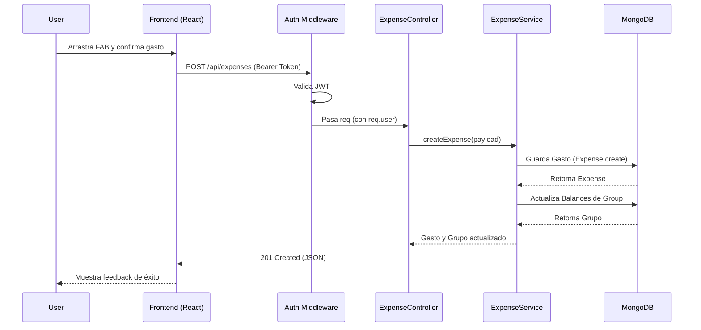

# Technical Design Document: Trincaunt Group Expense Control

## 1. Resumen Ejecutivo
Trincaunt es una aplicación de gestión de gastos compartidos en grupos, orientada a permitir a los usuarios registrar, clasificar y saldar deudas de manera equitativa. El sistema está construido bajo una arquitectura cliente-servidor clásica (SPA + API REST).

**Stack Tecnológico:**
- **Frontend:** React (con TypeScript), Vite, SCSS.
- **Backend:** Node.js, Express, TypeScript.
- **Base de Datos:** MongoDB (accedida mediante Mongoose ODM).
- **Autenticación:** JSON Web Tokens (JWT).

## 2. Arquitectura de Alto Nivel
El proyecto está dividido en dos grandes bloques lógicos alojados en el mismo repositorio (Monorepo lógico):

1. **Client (`/client`):** Aplicación SPA en React que gestiona el estado de la UI (modal, drag & drop, floating action buttons interactivos) y consume la API.
2. **API (`/api`):** Servidor backend en Node.js que sigue el patrón arquitectónico de múltiples capas:
   - **Routes:** Definen los endpoints expuestos y aplican middlewares de seguridad (ej. `protect` authMiddleware).
   - **Controllers:** Interceptan las peticiones HTTP, extraen parámetros y delegan la lógica de negocio.
   - **Services:** Concentran toda la lógica de negocio (cálculo de balances, repartos, generación de deudas).
   - **Models:** Interfaces y esquemas de Mongoose que mapean directamente las colecciones en MongoDB.

## 3. Flujo de Datos (Data Flow)
El ciclo de vida estándar de una solicitud dentro de la plataforma sigue este patrón:

1. **User Interaction:** El usuario realiza una acción en la UI de React (ej. registrar un gasto a través del *QuickExpenseFAB*).
2. **HTTP Request:** El cliente despacha una petición REST (ej. `POST /api/expenses`) incluyendo el token JWT en la cabecera `Authorization`.
3. **Middleware Interception:** El `authMiddleware` intercepta la llamada, verifica el JWT, decodifica el `userId` y lo inyecta en el objeto Request.
4. **Controller Routing:** El `ExpenseController` recibe el payload, valida su integridad básica y llama al `ExpenseService`.
5. **Business Logic:** El `ExpenseService` ejecuta la lógica central (actualizar los balances del grupo y de cada miembro, registrar el gasto).
6. **Data Persistence:** El modelo de Mongoose inserta el nuevo documento en la base de datos MongoDB.
7. **Response:** La respuesta JSON viaja de vuelta al cliente, que actualiza su estado (React Context / Local State) y repinta la interfaz.

## 4. Diagramas Mermaid

### 4.1. Diagrama de Arquitectura / Componentes

```mermaid
graph TD
    subgraph Frontend [React SPA (Vite)]
        UI[UI Components]
        State[React State & Context]
        API_Client[Fetch / API Client]
    end

    subgraph Backend [Node.js API]
        Router[Express Routes]
        Auth[JWT Middleware]
        Controllers[Controllers]
        Services[Business Logic Services]
        Models[Mongoose Models]
    end

    subgraph Database
        MongoDB[(MongoDB)]
    end

    UI <--> State
    State <--> API_Client
    API_Client -- HTTP/REST --> Router
    Router --> Auth
    Auth --> Controllers
    Controllers <--> Services
    Services <--> Models
    Models <--> MongoDB
```

### 4.2. Diagrama de Secuencia (Flujo: Añadir Gasto Rápido)



## 5. Modelo de Datos
La base de datos relacional-documental maneja las siguientes entidades principales:

- **User (`users`):** Almacena credenciales y datos básicos (`nombre`, `email`, `password`, `fecha_registro`).
- **Group (`groups`):** Estructura que agrupa usuarios. Contiene un arreglo de `miembros` y un subdocumento `balances` que trackea el saldo individual en tiempo real.
- **Expense (`expenses`):** Entidad central que documenta `descripcion`, `monto`, quién pagó (`pagado_por`), quiénes participan (`participantes`), `categoria` y `localization`.
- **DebtTransaction (`debttransactions`):** Representa una transferencia o pago compensatorio entre dos usuarios (`from`, `to`, `amount`, estado `paid`).
- **CategoryAlias (`categoryaliases`):** Sistema de mapeo para normalizar conceptos de gastos introducidos libremente por el usuario hacia categorías principales.
- **UserPreferences (`userpreferences`):** Preferencias personales de configuración (ej. filtros guardados, configuración del `QuickExpenseFAB` como el último icono usado y sus precios).
- **Note (`notes`):** Anotaciones colaborativas por grupo, con control de permisos (`lectores`, `editores`).

## 6. Endpoints y Contratos de API
La API expone varios recursos organizados lógicamente (todos bajo `/api` por convención y protegidos por JWT salvo login/register):

- **Users:**
  - `POST /users/register` - Crear cuenta
  - `POST /users/login` - Autenticar y obtener JWT
- **Groups:**
  - `GET /groups` - Listar mis grupos
  - `POST /groups` - Crear grupo nuevo
  - `GET /groups/:groupId` - Detalles del grupo
  - `POST /groups/:groupId/members` - Añadir usuario al grupo
- **Expenses:**
  - `GET /groups/:groupId/expenses` - Historial de gastos del grupo
  - `POST /expenses` - Registrar nuevo gasto
  - `GET /groups/:groupId/balance` - Obtener saldo actual
  - `GET /groups/:groupId/settle` - Algoritmo para sugerir deudas/transferencias de compensación.
- **Debt Transactions (Pagos de liquidación):**
  - `GET /groups/:groupId/debt-transactions` - Historial de liquidaciones
  - `POST /debt-transactions` - Registrar un pago entre miembros
  - `PATCH /debt-transactions/:transactionId/pay` - Marcar como completado
- **Others:**
  - Rutas para manejar notas (`/notes`), categorías alias (`/category-aliases`), preferencias (`/user-preferences`) y base de datos (`/db/export`, `/db/import`).
