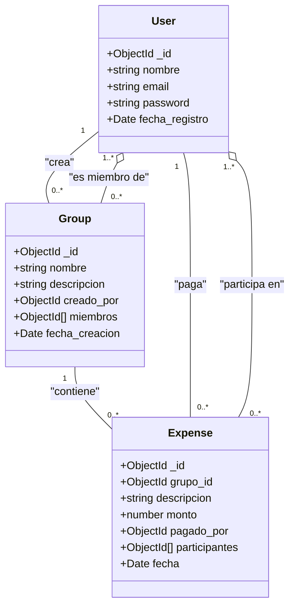

# Documentación Funcional - Trincaunt (Plataforma de Gastos Compartidos)

## 1. Objetivo del Sistema
El objetivo principal es proporcionar una plataforma centralizada para la gestión y división de gastos compartidos entre grupos de personas. El sistema permite a los usuarios registrarse, crear grupos (por ejemplo, para viajes, compañeros de piso o eventos) y registrar gastos, facilitando el cálculo de "quién debe a quién".

## 2. Alcance
El sistema abarca las siguientes funcionalidades principales:
- **Gestión de Usuarios**: Registro de nuevos usuarios con validación de datos y gestión de perfiles básicos.
- **Gestión de Grupos**: Creación de grupos, edición de detalles del grupo y gestión de la membresía (añadir usuarios a grupos).
- **Gestión de Gastos**: Registro de gastos dentro de un grupo, especificando quién pagó y quiénes participan en el gasto. Visualización del historial de gastos.

## 3. Roles de Usuario
- **Usuario Estándar**: Puede registrarse, crear grupos, unirse a grupos existentes, registrar gastos y ver el estado de cuentas de sus grupos.
- **Administrador** (Futuro/Opcional): Capacidad para gestionar todos los usuarios y grupos del sistema, moderación de contenido.

## 4. Descripción de la Persistencia de Datos (MongoDB)
El sistema utilizará MongoDB como base de datos NoSQL para almacenar la información.

### Esquema de Datos

#### 4.1. Usuario (User)
- `_id`: ObjectId (Generado automáticamente)
- `nombre`: String (Requerido, min 2 caracteres)
- `email`: String (Requerido, Único, formato válido de email)
- `password`: String (Requerido, encriptado)
- `fecha_registro`: Date (Default: now)

#### 4.2. Grupo (Group)
- `_id`: ObjectId
- `nombre`: String (Requerido)
- `descripcion`: String (Opcional)
- `creado_por`: ObjectId (Referencia a User)
- `miembros`: Array [ObjectId] (Referencias a User)
- `fecha_creacion`: Date

#### 4.3. Gasto (Expense)
- `_id`: ObjectId
- `grupo_id`: ObjectId (Referencia a Group)
- `descripcion`: String (Requerido)
- `monto`: Number (Requerido, debe ser mayor a 0)
- `pagado_por`: ObjectId (Referencia a User)
- `participantes`: Array [ObjectId] (Referencias a User, por defecto todos los miembros del grupo)
- `fecha`: Date (Default: now)

## 5. Reglas de Negocio

### Generales
- **Unicidad de Email**: No pueden existir dos usuarios con el mismo correo electrónico.
- **Inmutabilidad de ID**: El identificador único del usuario (`_id`) no puede ser modificado una vez creado.

### Grupos
- Un usuario debe existir para ser añadido a un grupo.
- Al crear un grupo, el creador se añade automáticamente como miembro.

### Gastos
- Un gasto debe estar asociado obligatoriamente a un grupo existente.
- El usuario que paga (`pagado_por`) y los participantes deben ser miembros activos del grupo en el momento de crear el gasto.
- El monto del gasto no puede ser negativo ni cero.

## 6. Mensajes de Error
El sistema devolverá códigos de estado HTTP apropiados junto con mensajes JSON descriptivos:

- **400 Bad Request**: Datos inválidos (ej. email mal formado, monto negativo).
- **401 Unauthorized**: Credenciales inválidas o falta de token.
- **403 Forbidden**: Intento de acceso a un grupo al que no se pertenece.
- **404 Not Found**: Recurso (usuario, grupo, gasto) no encontrado.
- **500 Internal Server Error**: Error inesperado del servidor o base de datos.

## 7. Flujos Funcionales Detallados

### 7.1. Creación de Usuario
1. El cliente envía `nombre`, `email`, `password`.
2. El sistema valida formato y unicidad del email.
3. Se guarda el usuario y se devuelve confirmación.

### 7.2. Login de Usuario
1. El cliente envía `email` y `password`.
2. El sistema busca al usuario por su `email`.
3. Si el usuario existe, se compara el `password` enviado con el hash almacenado en la base de datos.
4. Si las credenciales son correctas, se genera un token JWT (JSON Web Token) que contiene el ID del usuario y tiene una validez de 1 día.
5. El sistema devuelve el token y los datos del usuario.

### 7.3. Logout de Usuario
1. El cliente elimina el token JWT almacenado localmente (ej. en `localStorage`).
2. Al no tener el token, las futuras peticiones a rutas protegidas fallarán, cerrando la sesión de manera efectiva.

### 7.4. Creación de Grupo
1. Usuario autenticado (con token válido) envía `nombre` y `descripcion`.
2. El sistema crea el grupo y añade al creador a `miembros`.
3. Se devuelve el objeto del grupo creado.

### 7.5. Añadir Miembro a Grupo
1. Un miembro del grupo, desde la página de detalle del grupo, introduce el `email` del usuario a añadir.
2. El cliente envía una petición `POST` a la ruta `/groups/:groupId/members` con el `email`.
3. El sistema valida que el usuario a añadir existe.
4. Se añade el ID del nuevo usuario al array `miembros` del grupo.
5. Se devuelve el objeto del grupo actualizado.

### 7.6. Compartición de Gastos
1. Desde la página de detalle de un grupo, un miembro rellena el formulario de nuevo gasto (`monto`, `descripcion`).
2. El cliente envía una petición `POST` a la ruta `/expenses`.
3. El sistema valida que el usuario que crea el gasto pertenece al grupo.
4. Se registra el gasto, se asocia al grupo y se asigna por defecto a todos los miembros como participantes.
5. Se devuelve el objeto del gasto creado.

## 8. Casos de Uso

| ID | Caso de Uso | Descripción |
| :--- | :--- | :--- |
| CU01 | Registrarse | Crear una nueva cuenta en la plataforma con nombre, email y contraseña. |
| CU02 | Iniciar Sesión | Autenticarse en el sistema para obtener un token de acceso. |
| CU03 | Cerrar Sesión | Invalidar la sesión actual eliminando el token del cliente. |
| CU04 | Crear Grupo | Un usuario autenticado crea un nuevo espacio para compartir gastos. |
| CU05 | Añadir Miembro | Invitar a otro usuario registrado al grupo mediante su email. |
| CU06 | Registrar Gasto | Añadir un gasto realizado (con descripción y monto) a un grupo específico. |
| CU07 | Ver Balance de Grupo | Consultar la lista de miembros y gastos de un grupo. |

## 9. Diagrama Funcional (Mermaid)

